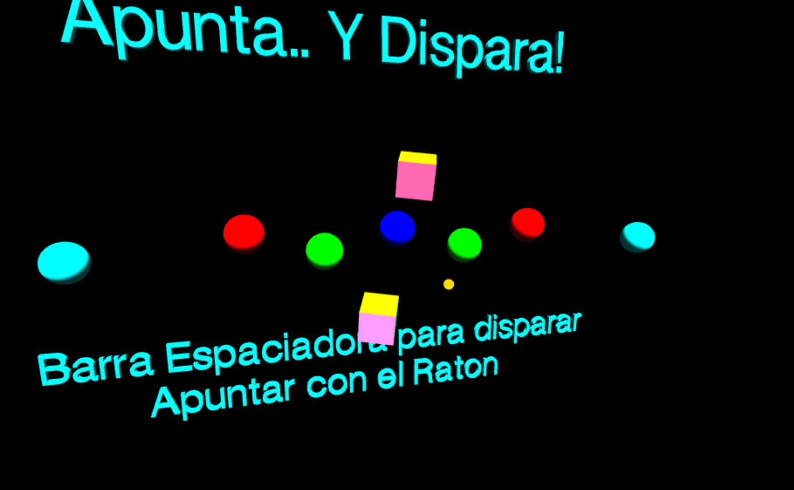
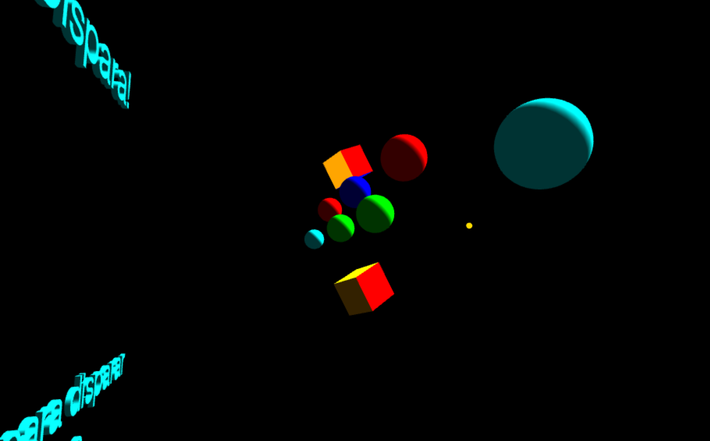
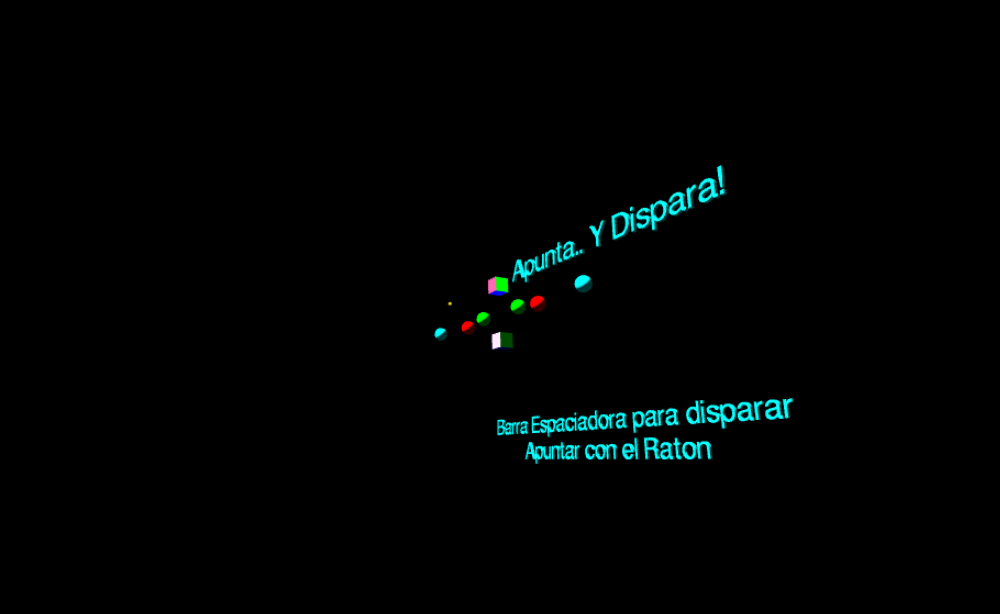
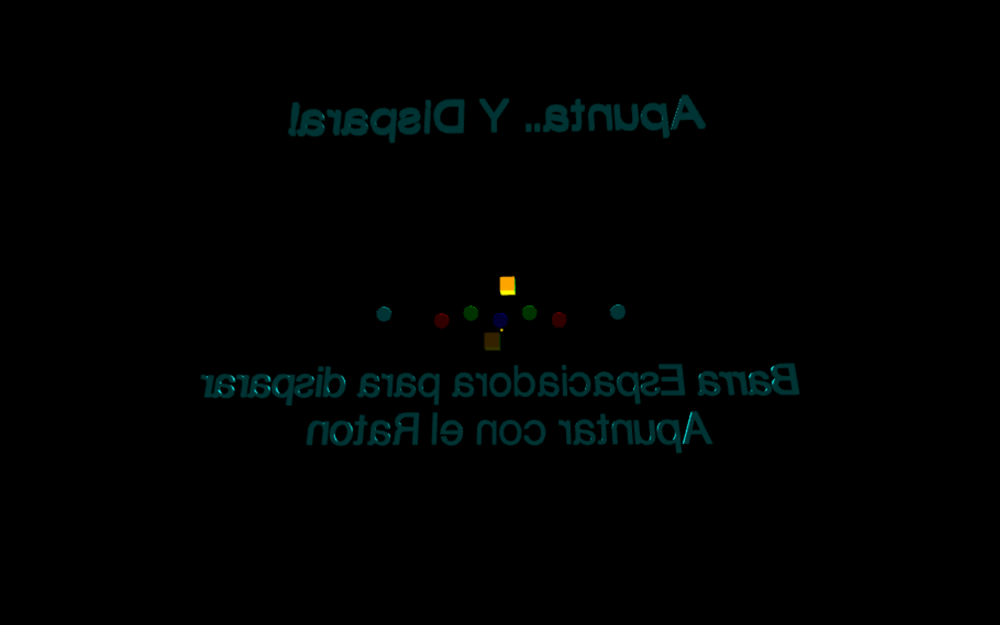

# Fisrt Proyect Three.js
[Ver Proyecto Fisrt Proyect Three.js](https://www.google.com "Ver Proyecto")

## Tecnologías Utilizadas:

- Three.js
- Javascript
- Howl - Sound

---
## Descripción 📘 

Primer contacto en profundidad con la librería Three.js, en el cual pude profundizar en conceptos tales como, materiales, luces, sombras, textos 3D, control de cámara y órbita, colisión de objetos, sonidos, entre otros detalles.

---
## Vista Principal ✔
---

---
## Vistas 360º 🎥
---

